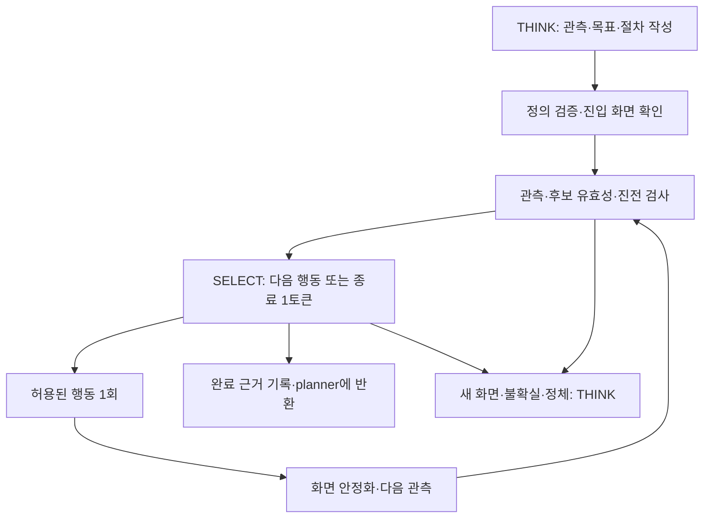

# SELECT 실행 절차: ‘몽유병 모드’ 설계

상태: 초기 구현 완료, 실제 실행 검증 중. 단일/다중 상태 flow, SELECT 반복, 완료·정체·중복 구간 판정, 사용자 요청 전달, 스킬 저장 도구를 구현했다. 아래 문서의 후속 최적화 항목까지 모두 완료되었다는 뜻은 아니다. 공유 모델 서버나 Cua 전역 설정은 변경하지 않는다.

## 목표

THINK가 관찰을 바탕으로 작은 실행 절차를 만들고, 익숙한 구간에서는 런타임이 그 절차를 반복한다. 매 행동의 좌표와 설명을 다시 생성하지 않고, 필요한 의미 판단은 이미지와 짧은 문맥을 입력한 1토큰 SELECT로 수행한다. THINK는 새로운 화면, 목표 변경, 판단 불가, 절차 수정 때 사용한다.

여기서 ‘생각 없이’는 관찰 없이 입력한다는 뜻이 아니다. 긴 추론·자연어·도구 인자를 매번 생성하지 않는다는 뜻이다. 사용자가 말한 확률 선택 접근을 구현하기 위한 자체 설계이며, 특정 서비스의 비공개 구현을 재현했다고 주장하지 않는다.

OCR, 특정 게임에 대한 실행 분기, 기본 게임 프리셋은 추가하지 않는다. 사용 중 모델이 만든 실행 절차와 관측 근거를 스킬 패키지에 저장한다. pi의 TUI·provider·대화·compaction을 계속 사용한다. 새 서버, Bun 전용 기능, 관리자 설치는 이 설계에 필요하지 않다.

## 현재 구현에서 바꿀 부분

| 현재 | 문제 | 변경 |
| --- | --- | --- |
| ny_act는 항상 1회 행동 후 반환 | 모든 작은 조작마다 planner 왕복 | 처음 보는 동작의 탐색용으로 유지 |
| ny_run_select는 이름 하나의 세트만 실행 | 화면이 바뀌면 THINK로 복귀하기 쉬움 | 서로 연결된 화면 상태와 후보 세트를 실행 |
| drag는 즉시 반환 | 목록 반복 이동마다 planner가 개입 | 반복 계약을 만족하면 SELECT 안에서 계속 |
| 클릭·드래그의 대상 픽셀을 같은 방식으로 비교 | 스크롤하면 움직여야 할 내용도 불일치로 취급 | 고정 버튼과 스크롤 영역의 검증 분리 |
| 같은 위치의 변화 없는 클릭을 일괄 차단 | 정상적인 반복과 입력 실패를 구분하지 못함 | 상태별 재실행 조건·진전 근거·횟수 제한 |
| WAIT/THINK만 자동 후보 | 완료도 새로운 THINK에 의존 | 상태별 완료 후보와 고정 WAIT/REPLAN 포함 |
| 프리셋 목표 중심의 SELECT 문맥 | 익명 작업의 실제 요청·수정사항 누락 가능 | 현재 작업 계약과 절차 목적을 반드시 전달 |
| 매 행동 1.8초 대기 및 중복 캡처 | 선택이 빨라도 고정 비용 발생 | 상태별 최소 대기, 관측 영역 안정화, 최신 캡처 재사용 |

## 실행 모델

단순 반복은 자기 자신으로 돌아오는 상태 하나, 복합 작업은 여러 상태의 유한 상태 기계다. 동일 상태에 머무르는 정상 반복과 A→B→A 순환 모두 지원한다. 모든 상태·후보는 모델이 정의한 자료이며 런타임은 게임 명칭이나 진행 의미를 해석하는 분기를 갖지 않는다.

실행 단위는 고정 클릭 묶음이 아니라 ‘다음 관측으로 결과를 확인할 수 있는 동작’이다. 첫 버전에서는 행동 사이 관측을 생략하는 무조건적 다중 클릭/드래그 매크로를 제공하지 않는다.

## 도구 surface

모델이 주로 사용하는 경로를 관찰 → 절차 정의 → 절차 실행으로 단순화한다.

- `ny_observe`: 기존 관찰·확대. crop와 grid의 조합, 중첩 regionPath 설명을 개선한다. 임의 crop의 grid를 지원하려면 원점·좌표 프레임을 명시하고 전체 창 좌표로 변환한다.
- `ny_define_flow`: 관찰 근거, 후보 동작, 상태 전환, 반복·완료 계약을 함께 정의하거나 수정한다. 성공 시 저장된 버전·검증 결과·후보 요약만 반환한다. 단일 상태를 기본으로 하여 매번 큰 그래프를 만들게 하지 않는다.
- `ny_execute_flow`: 등록한 버전을 현재 작업 계약에 연결하여 실행한다. 완료·예외·취소·예산 소진에서만 planner로 반환한다. pi의 Escape와 /stop을 그대로 따른다.
- `ny_act` / `ny_drag`: 처음 보는 화면에서 한 번 탐색할 때 유지한다. 성공했다고 무조건 절차를 생성하지 않는다.
- `ny_history`: inspect/validate/publish/retire/rollback을 flow에도 확장한다. 관리용 도구를 상태마다 추가하지 않는다.

기존 ny_define_set/ny_run_select는 한 상태 flow로 이관 가능한 호환 도구로 남긴다. 새 planner 안내에서는 flow 경로를 우선한다. 장시간 실행 중에는 진행 표시와 로컬 trace만 갱신하고 각 반복의 전체 화면을 대화에 쌓지 않는다.

## 데이터 계약

다음은 최소 계약이다. 이름은 구현 때 확정하되 의미와 검증 책임은 유지한다.

| 구성 | 저장 내용 | 검증 책임 |
| --- | --- | --- |
| 작업 계약 | 사용자 요청의 출처, 현재 목표, 범위·제약, 수정 revision | 익명 run에도 필수. 프리셋이 사용자 요청을 대체하지 않음 |
| 절차 | id/version, 국소 목표, 진입 상태, 상태 목록, 근거 | 참조·좌표·예산·후보 ID를 코드로 검증 |
| 상태 | 정적 화면 근거, 관측 ROI, 후보, 완료 설명 | 픽셀 근거는 위치·화면 적합성, 의미는 SELECT |
| 후보 | 짧은 라벨/적용 조건, 허용 동작, 좌표, 예상 다음 상태 | 동작 종류는 click/drag/wait 및 제어 결과로 제한 |
| 반복 계약 | 진전 ROI, 재실행 조건, 정체 허용 수, 대기 범위 | 정상 반복과 실패 재입력을 구분 |
| 완료 계약 | 국소 완료의 관측 조건, 필요한 근거, 확인 정책 | 제한 시간·무변화만으로 의미적 성공 선언 금지 |
| 실행 상태 | pinned version, 현재 상태, 최근 선택·관측, 횟수, deadline | 프로세스 중단 후 입력을 자동 재실행하지 않음 |

조건은 두 종류로 분리한다.

1. 코드가 계산하는 조건: 창 식별, ROI 안정화·변화, 시간·횟수, 등록된 이미지 근거 일치, 취소 및 연결 상태.
2. SELECT가 판독하는 조건: 원하는 항목이 보임, 목록 끝이 보임, 다음 화면으로 진행됨, 완료 표시가 보임 등.

두 번째 조건은 자연어를 JS로 실행하거나 픽셀 차이로 의미를 증명하지 않는다. 조건 문장은 후보 설명에 들어가고, 선택 결과와 화면 ID를 함께 남긴다. `done`은 이 절차의 국소 완료이며 전체 사용자 작업 완료와 구분한다. 모델이 반복 정책을 바꿀 수 있어도 코드 실행, 권한 변경, 새 작업 범위 추가를 허용하지 않는다.

## 한 번의 SELECT로 행동·반복·종료 함께 판정

목록 이동의 후보 예시:

| 토큰 | 의미 | 실행 결과 |
| --- | --- | --- |
| A | 아직 목표 미도달, 이동 가능한 상태 → 한 구간 이동 | 등록된 드래그, 같은 상태 재관찰 |
| B | 목표가 현재 화면에서 충족됨 | 완료 조건 확인 및 근거 반환 |
| C | 로딩·관성 이동 중 | WAIT 후 같은 상태 재관찰 |
| D | 예상 밖 화면·판독 불가 | REPLAN으로 반환 |

매 반복에 ‘계속할까?’와 ‘무엇을 할까?’를 각각 질의하지 않는다. 위 선택 하나가 두 판단을 겸한다. 반복마다 목표, 제약, 현재 상태, 직전 행동·효과, 정체 횟수, 필요한 화면만 제공한다. 생각 과정이나 설명은 출력하지 않는다.

여러 화면에서는 현재 상태와 등록된 인접 상태를 우선 검사한다. 정적 이미지 근거가 하나로 명확하게 맞으면 상태 이동에 모델 호출을 쓰지 않는다. 여러 상태가 시각적으로 모호하면 상태별 유효 동작과 전환을 한 선택지 집합으로 만들어 SELECT한다. 모호한데 임의로 상태를 정하거나 모든 저장 절차를 매번 훑지 않는다. 후보가 너무 많으면 planner가 상태를 분리한다.

최종 완료에만 추가 확인이 필요한 정책을 둘 수 있다. 모든 반복에 검증 SELECT를 하나 더 붙이지 않는다. 재확인은 항상 독립적인 증명이 되는 것은 아니므로 입력 전달·화면 안정화·관측 근거와 함께 평가한다.

## 목록 스크롤의 두 가지 계약

### 끝까지 이동

같은 화면의 스크롤 영역과 방향을 관측하고, 이동 동작·끝 판정·WAIT/REPLAN을 한 번 정의한다. 각 드래그 후 planner로 돌아오지 않고 ROI가 안정화되면 SELECT로 다음 동작을 고른다.

드래그 뒤 ‘같은 화면’이라는 사실만으로 끝에 도달했다고 보지 않는다. 입력 누락, 로딩, 드래그 방향 오류도 같은 결과를 만들 수 있다. 정체 감지는 끝 확인 후보를 활성화하는 근거이지 완료 판정 자체가 아니다. 방향에 따른 내용 이동·스크롤바 또는 경계 표현 등 사용 가능한 시각 근거를 확인하고, 입증할 수 없으면 `stalled`로 반환한다. 가장자리에서 무변화 재확인이 필요하면 별도의 제한된 probe 동작으로 명시한다.

### 특정 조건에 맞는 항목을 찾으며 이동

각 구간을 SELECT가 읽고 찾는 항목이 없을 때만 다음 구간으로 이동한다. 관측 영역이 겹치는 짧은 드래그를 사용하여 항목 누락을 줄인다. 목표가 보이면 그 화면을 근거로 `found`를 반환한다. 동적으로 움직인 항목의 클릭 좌표까지 과거 좌표로 재사용하지 않는다. 첫 구현에서는 위치 확정이 필요하면 planner가 확대·클릭하고, 후속 단계에서 제한된 격자 선택으로 정밀 위치 결정을 추가한다.

이 둘은 사용자가 선택하는 고정 게임 프리셋이 아니다. 모델이 사용자의 요청으로부터 계약을 작성하며 위 내용은 설계 설명일 뿐 자동 로드 자료에 넣지 않는다.

## 이미지 검증과 시간 절감

- 고정 버튼은 기존 대상 이미지 검사를 활용한다. 목록 드래그는 움직이는 카드 그림 대신 관측된 스크롤 영역의 프레임·고정 주변 근거를 검증하고, 영역 내부 변화는 진전 신호로 사용한다. 정적 anchor만 맞는다는 이유로 새 팝업을 무시하지 않는다. SELECT에 작은 전체 창 문맥과 필요한 상세 ROI를 제공한다.
- 안정화는 화면 전체가 아니라 관련 ROI에서 판정한다. 배경 애니메이션 때문에 영원히 대기하지 않도록 마스크·최대 대기 후 SELECT/REPLAN 경로를 둔다. 안정화는 의미적 성공이 아니다.
- 초기 단계에서는 매 의미 판단마다 SELECT를 수행한다. 모델 호출 없이 반복하는 기능은 별도로 검증된 기계적 완료 조건이 있는 경우만 후속 검토한다.
- 입력 후 화면을 다음 반복의 초기 관측으로 재사용한다. 긴 모델 대기 후에는 현재처럼 입력 직전 재관측한다. 추론이 짧아도 재관측 생략은 기본값으로 두지 않고 실제 비용과 창 변경 위험을 측정한 뒤 결정한다.
- WAIT는 최소/최대/증가 간격을 상태별로 정의할 수 있다. 화면이 그대로 로딩 중인 동안 긴 THINK나 같은 SELECT를 과도하게 호출하지 않되, 계속 움직이는 내용의 의미 검사는 생략하지 않는다.
- SELECT는 독립된 짧은 문맥을 사용한다. 모델 주소·인증은 현재 pi provider에서 가져오며 플로우에 저장하지 않는다. 모델 변경 시 logprobs·이미지·비추론 1토큰 동작을 확인하고 다른 서버로 몰래 전환하지 않는다.
- 현재 top-k에서 모든 후보가 나와야 하는 조건은 불필요한 THINK 복귀를 유발할 수 있다. 후보 누락을 확률 0으로 채우지 말고, 반환된 확률 질량과 미관측 질량의 보수적 상한으로 승자·margin이 보장되는 경우만 허용하는 decoder를 별도 테스트한다. 제공자가 정규화 방식이나 top-k 의미를 보장하지 않으면 기존 보수적 중단을 유지한다. logprob 점수는 성공 확률이 아니다.

## 오래 실행해도 planner가 개입할 수 있게

한 tool call 안에서 여러 SELECT·드래그를 실행하되 시간/행동/연속 WAIT/정체 예산이 있다. 이는 단순히 현재 5회를 큰 숫자로 바꾸는 작업이 아니다. 1토큰 응답이 600초 기다리는 서버 상황도 감안하여 개별 요청과 전체 실행 deadline을 구분한다.

새 사용자 지시가 들어오면 pi가 메시지를 큐에 넣기만 하는지 즉시 전달하는지 실제 확인한다. 실행 중 수정 메시지를 즉시 전달할 수 없는 경우 UI에 Escape 후 수정 지시를 안내하고, 지원 가능한 pi 이벤트로 현재 flow를 취소·반환하는 방식을 우선 구현한다. 실행 도중 사용자 범위가 바뀌었는데 이전 계약으로 새 입력을 계속 보내면 안 된다. 캡처·모델 요청·대기는 AbortSignal을 따르고, 전달 완료된 입력은 취소했다고 되돌아간 것으로 간주하지 않는다.

진행 표시 예: `SELECT · 목록 탐색 · 이동 8회 · 진전 있음 · 42초`. THINK가 아닌 단순 대기/전환도 구분한다. 정상 내부 반복은 planner 대화를 생성하지 않는다. 종료 시 이유, 마지막 화면, 수행 요약, 완료 근거, 미해결 사항을 한 번에 반환한다.

Cua 세션 복구는 transport가 담당한다. 연결이 불명확한 입력은 재전송하지 않고 새 화면부터 확인한다. 동일 연결 실패를 모델에게 반복 던지지 않고 제한된 복구 후 `driver_error`로 종료한다. 공유 드라이버·다른 에이전트·모델 서버는 수정하지 않는다.

## 생성·재사용·개선

반복을 모델의 자발적인 눈치에만 맡기지 않는다. 같은 화면에서 같은 종류의 직접 행동이 반복되면, 도구 결과에 관측 근거와 함께 `reusable_flow_suggested`를 제공한다. 이것은 절차 생성을 유도하는 신호이지 자동 클릭 허가나 검증된 절차 승격이 아니다. 첫 동작 전에 반복임을 알면 모델이 바로 단일 상태 flow를 정의할 수 있다.

초안은 현재 run에 저장한다. 실행 성공·실패 trace에서 모델이 수정한 새 버전을 만들고, 재사용할 가치가 있는 검증된 절차를 앱/상황 스킬 패키지에 게시한다. 익명 run도 별도 프리셋부터 만들 필요 없이 절차를 저장할 수 있게 한다. 패키지에는 정의와 이미지 근거를 함께 복사하고 현재 run 진행 상태·인증·서버 주소는 포함하지 않는다.

실행은 시작 때 version을 고정한다. 모델·사람의 교정은 다음 실행에 적용하며 실패 버전과 근거는 남긴다. 이전 픽셀 근거를 실패할 때마다 새 화면으로 자동 덮어쓰지 않는다. 앱 레이아웃이 달라져 근거가 맞지 않으면 재관찰·수정을 요구한다. compaction 이후에도 작업 계약과 flow 진행 요약은 파일에서 재구성한다.

## 구현 순서와 완료 기준

1. **작업 계약과 단일 상태 flow**: 현재 요청·수정 revision 전달, 모델이 만드는 drag/WAIT/DONE/REPLAN 후보, 반복 계약, 짧은 반환. 현재 스크롤의 planner 왕복을 먼저 제거한다.
2. **진전·종료 판정**: 스크롤 영역 검증, 안정화, 정체와 끝 구별, 취소·driver 복구·모델 지연 처리. 관련 ROI를 가진 합성 화면/모의 드라이버로 검증한다.
3. **화면 전환 그래프**: 이미 관찰한 인접 세트 연결, 완료 화면에서 이전 목록으로 돌아오는 순환. 처음 보는 화면에서만 재계획한다.
4. **스킬 보존과 사용성**: define/execute/history 통합, 모델의 생성 유도, 버전 관리·근거 보존, 사람 피드백, pi 메시지 개입 경로.
5. **성능 최적화**: 중복 캡처, 이미지 크기, 프롬프트 재사용, top-k 불필요 중단을 측정하여 개선한다. 숫자를 크게 바꾸거나 가드를 모두 제거하는 식으로 속도를 얻지 않는다.

검증 기준:

- 이미 정의된 목록 flow로 10번 정상 이동하는 모의 실행에서 planner 왕복은 내부적으로 0회. define/execute 호출과 종료 후 planner 확인은 별도 집계한다.
- 화면 변화를 포함하는 등록된 두 상태 순환도 THINK 없이 이어진다. 미등록 화면은 실제 입력 전에 반환한다.
- 멈춘 화면·실패 드래그·로딩·리스트 끝을 별도 사례로 테스트한다. 무변화만으로 done이 나오지 않는다.
- 검색 중 중간 항목 발견 시 다음 드래그를 보내지 않는다. 재사용한 오래된 좌표로 클릭하지 않는다.
- 취소·범위 변경·창 변경·세션 만료·추론 지연 후 잘못된 입력이 추가되지 않는다.
- 이전/이후가 다른 입력 근거와 각 선택의 원시 점수·선택지 매핑을 trace에 기록한다. 실제 상호작용은 사용자가 시험을 끝낸 후 검증하고 현재 실행은 중단하지 않는다.

성능은 setup 시간과 재사용 실행 시간을 나누어 측정한다. THINK 호출 수·시간, SELECT 호출 수·시간, 이미지 prefill, 캡처, 입력, 대기, 중단 사유를 분리한다. 비용은 대략 `초기 정의 + 각 단계의 관측/SELECT/입력/안정화 + 예외 THINK`이며, 1토큰 생성만으로 이미지 prefill과 서버 대기가 사라지지는 않는다. 실제 게임 성능 수치는 구현·검증 전에 약속하지 않는다.

## 초기 구현의 범위와 제한

`src/flow.ts` 및 `src/visual-memory.ts`가 실행을 담당한다. 모델은 `ny_define_flow`, `ny_execute_flow`, `ny_flow`를 사용한다. scan 상태는 관심 영역의 특징과 대표 화면을 최대 100개 보관하고, 과거 구간 재등장 시 관련 과거/현재 영역을 합친 비교 이미지만 SELECT에 제공한다. 대화에 전체 이미지 이력을 재주입하지 않는다. 동일 flow 버전·사용자 요청 revision에서는 탐색 기억을 이어 쓰며, 반복 구간을 끝 도달로 자동 간주하지 않는다.

현재 상태 전환은 서로 구분되는 정적 근거가 필요하다. 복수 상태가 동시에 맞으면 재계획으로 반환한다. 의미가 모호한 상태를 한 번의 SELECT에서 함께 판별하는 확장, top-k 누락 확률 상한 계산, 이동 항목의 격자 클릭은 아직 구현하지 않았다. 저장한 flow를 다른 해상도·레이아웃에서 쓰기 전에 다시 검증해야 한다.

Ollama 연결의 `ollamaThinkingMode`는 기본 `boolean`이다. 강도 문자열을 받는 서버는 `levels`로 설정하면 pi의 low 등 선택값을 그대로 전달한다. 서버나 모델이 받지 못하는 강도는 자동으로 다른 값으로 바꾸지 않는다. SELECT는 계속 `think:false`를 사용한다.

후속 검토 자료는 [2026-09 연구 메모](research-2026-09.md)에 정리했다. 직접 행동·기존 후보 세트에는 전체 창 기준 `point={x,y}` 지정도 지원하여 중심과 사각형 원점의 혼동을 줄인다. 좌표는 임의로 보정하지 않으며 기존 이미지 가드를 통과해야 한다. 관찰 전용 flow는 `actions=[]`로 정의할 수 있고 `maxWaits` 기본값은 40이다. 전체 시간 제한과 취소는 동일하게 적용된다.

자동 진행 관찰은 더 작은 인터페이스 `ny_wait(until, maxSeconds)`도 제공한다. 런타임이 입력 없는 단일 상태를 만들고 WAIT/DONE/REPLAN을 선택하므로 모델이 정적 앵커나 좌표를 작성할 필요가 없다. 이름 있는 재사용 flow와 달리 정의를 저장하지 않는다. 클릭/드래그가 있는 상태의 이미지 앵커 검사는 그대로 유지한다. 기존 `ny_wait(seconds)`는 한 번 기다리고 마지막 화면만 캡처한다.

조건 대기는 서로 다른 시점의 새 관측에서 DONE이 연속 두 번 나와야 반환한다. 중간 WAIT/불확실성은 확인 횟수를 초기화한다. 입력 없는 대기에 한해 일시적인 불확실성·REPLAN을 최대 두 번 재관측하며, 이후에는 planner로 반환한다. 입력을 보내는 flow에는 이 예외 허용을 적용하지 않는다.
